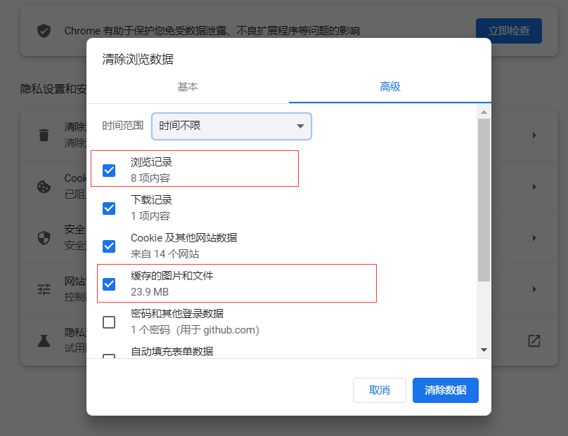
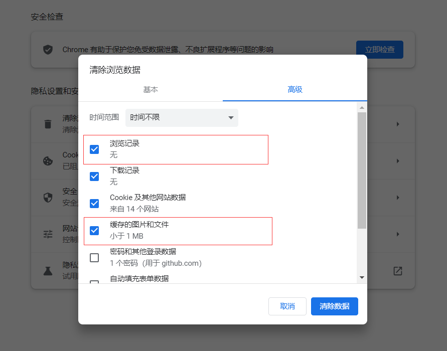
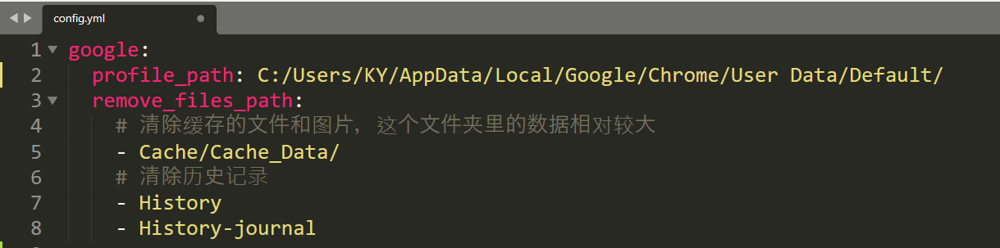

## ClearGoogleChromeCache

- 清除Google浏览数据包括
  - 缓存的图片和文件
  - 浏览记录
  - 可以自定义删除的路径

### 使用前

### 使用后

### 使用方法

1. 查看个人资料路径：
   - 在浏览器输入`chrome://version/`
     - 
   - 复制个人资料路径，并将**反斜杠**修改为**斜杆**，同时在路径的最后面加上**斜杆**。
   - 将路径放置在`config.yml`里面
     - 

2. 运行**clearGoogleChromeCache.exe**，清除google浏览器缓存的数据。

### 补充

- 确保**clearGoogleChromeCache.exe**与**config.yml**在同一个目录下。
- 填写 **config.yml** 里边的路径小心一点，如果不小心，可能会误删掉重要的文件。
- 执行**clearGoogleChromeCache.exe**前，请暂时关闭谷歌浏览器。
- 很多浏览器有关闭浏览器清空缓存的功能，而谷歌浏览器反其道而行之，实在难以理解。

