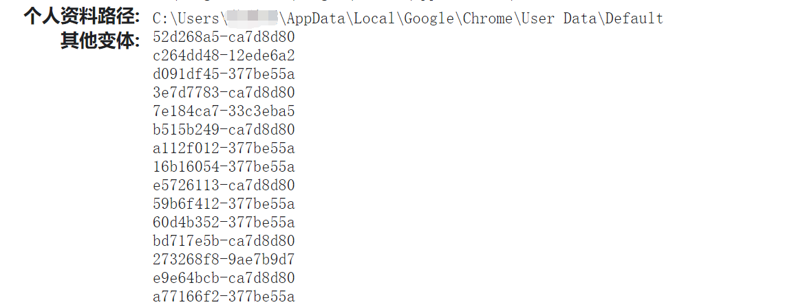
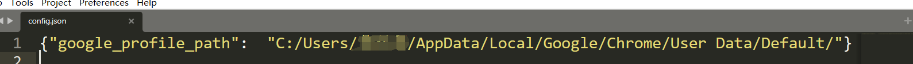

## ClearGoogleChromeCache

- 清除Google浏览器的缓存的文件和图片
- 包括浏览记录

### 使用方法

1. 查看个人资料路径：
   - 在浏览器输入`chrome://version/`
     - 
   - 复制个人资料路径，并将**反斜杠**修改为**斜杆**，同时在路径的最后面加上**斜杆**。
   - 将路径放置在`config.json`里面
     - 

2. 运行**clearGoogleChromeCache.exe**，清除google浏览器缓存的数据。

### 补充

- 确保**clearGoogleChromeCache.exe**与**config.json**在同一个目录下。
- 执行**clearGoogleChromeCache.exe**前，请暂时关闭谷歌浏览器。
- 很多浏览器有关闭浏览器清空缓存的功能，而谷歌浏览器反其道而行之，实在难以理解。